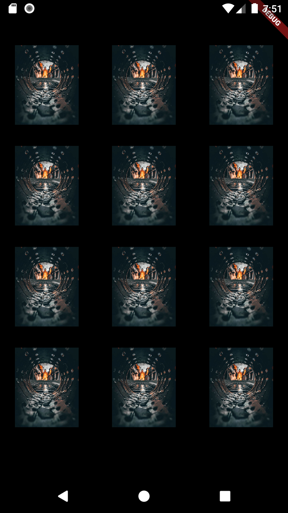

<span style="color: red">Code:</span>
```dart

 Widget grid_view =  GridView.extent(
            maxCrossAxisExtent: 200,
            mainAxisSpacing: 10,
            crossAxisSpacing: 5,
            children: List.generate(
              12,
              (index) {
                return Container(
                    padding: const EdgeInsets.only(top: 20),
                    child: Image.asset('images/img.jpeg'));
              },
            )))

```

<sapn style="color:green">Output:</span>

