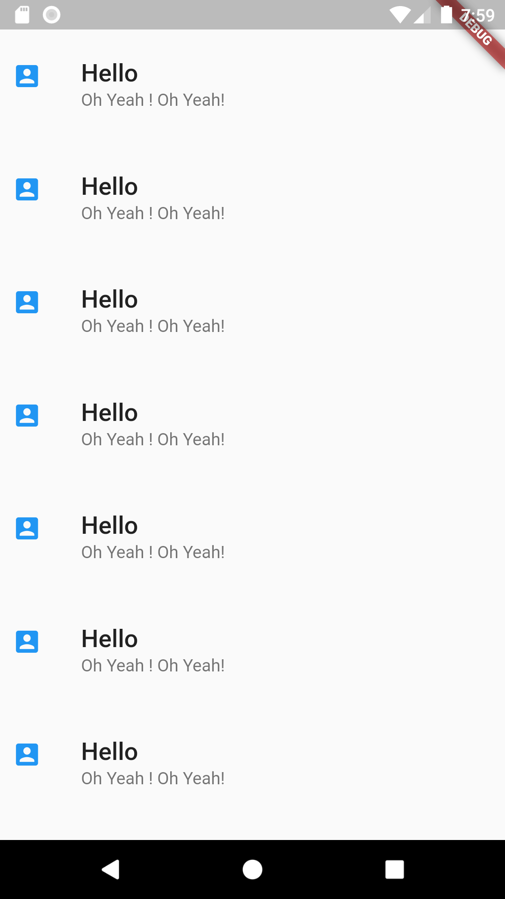

<span style="color: red">Code:</span>

```DART
Widget list_tile = ListView(
    children: List.generate(10, (index) {
  return ListTile(
    // mouseCursor: MouseCursor.uncontrolled,
    contentPadding: const EdgeInsets.all(10.0),
    title: Text("Hello",
        style: TextStyle(
          fontWeight: FontWeight.w500,
          fontSize: 20,
        )),
    subtitle: Text("Oh Yeah ! Oh Yeah!"),
    leading: Icon(
      Icons.account_box,
      color: Colors.blue[500],
    ),
    // hoverColor: Colors.green,
    // focusColor: Colors.yellow,
    // mouseCursor: MaterialStateMouseCursor.clickable ,
  );
}));

```

<sapn style="color:green">Output:</span>
