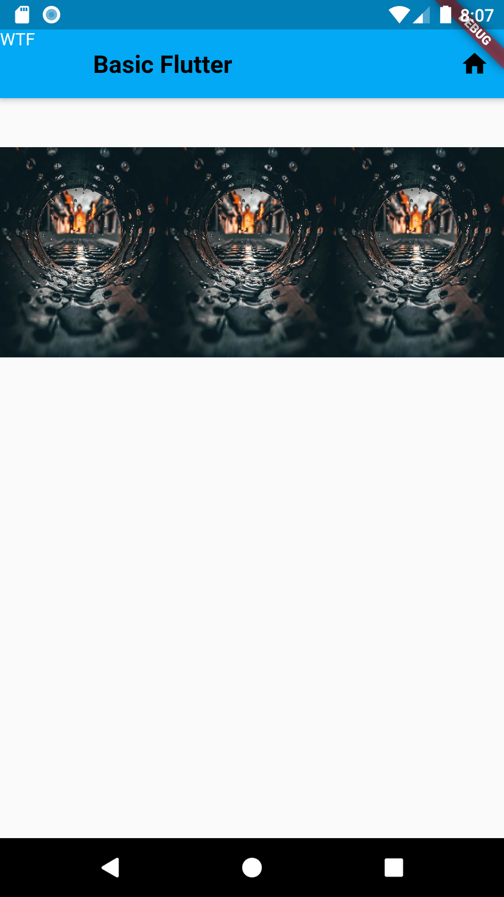
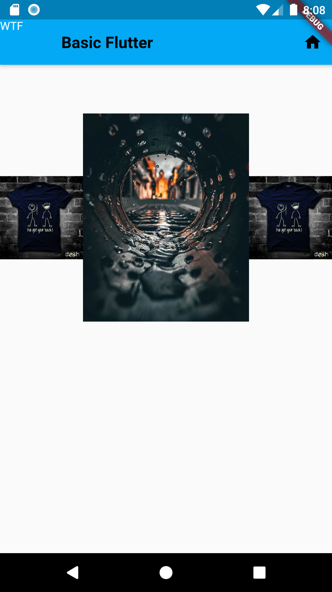

# Flutter-Easy-Doc

## Curved_Navigation_Bar

###### Preview :

|                                            |                                            |                                            |
| :----------------------------------------: | :----------------------------------------: | :----------------------------------------: |
|  |  |  |

###### Code :

```dart
import 'package:flutter/material.dart';
import 'package:curved_navigation_bar/curved_navigation_bar.dart';

void main() => runApp(
    MaterialApp(debugShowCheckedModeBanner: false, home: BottomNavBar()));

class BottomNavBar extends StatefulWidget {
  @override
  _BottomNavBarState createState() => _BottomNavBarState();
}

class _BottomNavBarState extends State<BottomNavBar> {
  int _pageIndex = 0;
  GlobalKey _bottomNavigationKey = GlobalKey();

  PageController _pageController;

  List<Widget> tabPages = [
    Screen1(),
    Screen2(),
    Screen3(),
  ];

  @override
  void initState() {
    super.initState();
    _pageController = PageController(initialPage: _pageIndex);
  }

  @override
  void dispose() {
    _pageController.dispose();
    super.dispose();
  }

  @override
  Widget build(BuildContext context) {
    return Scaffold(
      appBar: AppBar(
        title: new Text("Curve Navigation Bar"),
        centerTitle: true,

      ),
      body: tabPages[_pageIndex],
      bottomNavigationBar: CurvedNavigationBar(
        key: _bottomNavigationKey,
        index: _pageIndex,
        height: 50.0,
        items: <Widget>[
          Icon(Icons.home, size: 30),
          Icon(Icons.shopping_cart, size: 30),
          Icon(Icons.perm_identity, size: 30),
        ],
        color: Colors.white,
        buttonBackgroundColor: Colors.white,
        backgroundColor: Colors.blueAccent,
        animationCurve: Curves.ease,
        animationDuration: Duration(milliseconds: 300),
        onTap: (index) {
          setState(() {
            _pageIndex = index;
          });
          // print(index);
        },
      ),
    );
  }
}

class Screen1 extends StatelessWidget {
  @override
  Widget build(BuildContext context) {
    return Container(
      color: Colors.blue,
      child: Center(child: Text("Screen 1")),
    );
  }
}

class Screen2 extends StatelessWidget {
  @override
  Widget build(BuildContext context) {
    return Container(
      color: Colors.blue,
      child: Center(child: Text("Screen 2")),
    );
  }
}

class Screen3 extends StatelessWidget {
  @override
  Widget build(BuildContext context) {
    return Container(
      color: Colors.blue,
      child: Center(child: Text("Screen 3")),
    );
  }
}


```

###### Extra :

```yaml
dependencies:
  curved_navigation_bar: ^0.3.3
```

<hr>


## Silver AppBar


###### Preview : 

|                                           |                                            |                                            |
| :----------------------------------------: | :----------------------------------------: | :----------------------------------------: |
|  |  |


###### Code

```dart

import 'package:flutter/material.dart';

void main() {
  runApp(MaterialApp(
    title: "SilverAppBar",
    home: new Home(),
    debugShowCheckedModeBanner: false,
  ));
}

class Home extends StatelessWidget {
  @override
  Widget build(BuildContext context) {
    // TODO: implement build
    // throw UnimplementedError();
    return Scaffold(
      backgroundColor: Colors.white,
      body: CustomScrollView(slivers: <Widget>[
        SliverAppBar(
          leading: IconButton(icon: Icon(Icons.menu), onPressed: null),
          backgroundColor: Colors.blueAccent[100],
          title: new Container(
            alignment: Alignment.center,
            child: new Text("Silver Appbar"),
          ),
          pinned: true,
          expandedHeight: 200.0,
          flexibleSpace: new FlexibleSpaceBar(
            background: MyFlexibleAppBar(),
          ),
          actions: <Widget>[
            IconButton(icon: Icon(Icons.save), onPressed: null)
          ],
        ),
        SliverList(
          delegate: SliverChildListDelegate(
            [
              bal(),
            ],
          ),
        ),
      ]),
    );
  }
}

Widget bal() {
  return Column(
    mainAxisAlignment: MainAxisAlignment.center,
    children: List.generate(10, (index) {
      return Card(
        child: ListTile(
          leading: Icon(Icons.account_balance),
          title: new Text("AAFF"),
          subtitle: Text("Holy Shit!"),
          contentPadding: const EdgeInsets.all(10.0),
        ),
      );
    }),
  );
}

class MyFlexibleAppBar extends StatelessWidget {
  @override
  Widget build(BuildContext context) {
    // TODO: implement build
    // throw UnimplementedError();
    return Container(
      child: Column(
        children: <Widget>[
          new Column(
            crossAxisAlignment: CrossAxisAlignment.center,
            children: <Widget>[
              Padding(padding: const EdgeInsets.only(top: 80.0)),
              Text(
                "Balance",
                style: TextStyle(
                  fontSize: 25.0,
                ),
              ),
              Text(
                "\$20,203.45",
                style: TextStyle(
                  fontSize: 35.0,
                ),
              ),
              Text(
                "+23%",
                style: TextStyle(
                  fontSize: 20.0,
                ),
              ),
            ],
          ),
          Row(
            mainAxisAlignment: MainAxisAlignment.spaceBetween,
            children: <Widget>[
              // Padding(padding: const EdgeInsets.only(top: 50.0)),
              Container(
                padding: const EdgeInsets.only(
                  top: 25.0,
                  left: 10.0,
                ),
                child: Text("Curencey",
                    style: TextStyle(
                      fontSize: 15.0,
                    )),
              ),
              Container(
                padding: const EdgeInsets.only(
                  top: 25.0,
                  right: 10.0,
                ),
                child: Text("7th July,2020",
                    style: TextStyle(
                      fontSize: 15.0,
                    )),
              ),
            ],
          )
        ],
      ),
    );
  }
}


```


## Folding Cell


###### Preview : 

|                                           |                                            |                                            |
| :----------------------------------------: | :----------------------------------------: | :----------------------------------------: |
|  |  |


###### Code

```dart

import 'package:flutter/material.dart';
import 'package:folding_cell/folding_cell.dart';

void main() {
  runApp(MyApp());
}

final _foldingCellKey = GlobalKey<SimpleFoldingCellState>();

class MyApp extends StatelessWidget {
  // This widget is the root of your application.
  @override
  Widget build(BuildContext context) {
    return MaterialApp(
      title: 'Flutter Demo',
      theme: ThemeData(
        primarySwatch: Colors.blue,
        visualDensity: VisualDensity.adaptivePlatformDensity,
      ),
      home: MyHomePage(title: 'Folding Cell'),
      debugShowCheckedModeBanner: false,
    );
  }
}

class MyHomePage extends StatefulWidget {
  MyHomePage({Key key, this.title}) : super(key: key);

  final String title;

  @override
  _MyHomePageState createState() => _MyHomePageState();
}

class _MyHomePageState extends State<MyHomePage> {
  @override
  Widget build(BuildContext context) {
    return Scaffold(
      backgroundColor: Colors.grey,
      appBar: AppBar(
        title: Text(widget.title),
      ),
      body: Container(
        child: ListView(
          children: <Widget>[
            Container(
              child: SimpleFoldingCell.create(
                key: _foldingCellKey,
                frontWidget: _buildFrontWidget(),
                innerWidget: _buildInnerWidget(),
                cellSize: Size(MediaQuery.of(context).size.width, 140),
                padding: EdgeInsets.all(15),
                animationDuration: Duration(milliseconds: 300),
                borderRadius: 10,
                onOpen: () => print('cell opened'),
                onClose: () => print('cell closed'),
              ),
            ),
          ],
        ),
      ),
      floatingActionButton: FloatingActionButton(
        onPressed: null,
        tooltip: 'Increment',
        child: Icon(Icons.add),
      ), // This trailing comma makes auto-formatting nicer for build methods.
    );
  }
}


Widget _buildFrontWidget() {
  return Container(
    color: Color(0xFFffcd3c),
    alignment: Alignment.center,
    child: Stack(
      children: <Widget>[
        Align(
          alignment: Alignment.center,
          child: Text(
            "CARD TITLE",
            style: TextStyle(
              color: Color(0xFF2e282a),
              fontSize: 20.0,
              fontWeight: FontWeight.bold,
            ),
          ),
        ),
        Positioned(
          right: 5,
          bottom: 0,
          child: FlatButton(
            onPressed: () => _foldingCellKey?.currentState?.toggleFold(),
            child: Text(
              "OPEN",
            ),
            textColor: Colors.white,
            color: Colors.indigoAccent,
            splashColor: Colors.white.withOpacity(0.5),
          ),
        )
      ],
    ),
  );
}

Widget _buildInnerWidget() {
  return Container(
    color: Color(0xFFecf2f9),
    padding: EdgeInsets.only(top: 10),
    child: Stack(
      children: [
        Align(
          alignment: Alignment.topCenter,
          child: Text(
            "CARD TITLE",
            style: TextStyle(
              color: Color(0xFF2e282a),
              fontSize: 22.0,
              fontWeight: FontWeight.bold,
            ),
          ),
        ),
        Align(
          alignment: Alignment.center,
          child: Text(
            "CARD DETAIL",
            style: TextStyle(
              color: Color(0xFF2e282a),
              fontSize: 40.0,
            ),
          ),
        ),
        Positioned(
          right: 5,
          bottom: 0,
          child: FlatButton(
            onPressed: () => _foldingCellKey?.currentState?.toggleFold(),
            child: Text(
              "Close",
            ),
            textColor: Colors.white,
            color: Colors.indigoAccent,
            splashColor: Colors.white.withOpacity(0.5),
          ),
        ),
      ],
    ),
  );
}


```


###### Extra :

```yaml
dependencies:
  folding_cell: "^1.0.0"
```

<hr>


## Dashboard


###### Preview :

|                                           |                                            |                                            |
| :----------------------------------------: | :----------------------------------------: | :----------------------------------------: |
|  |  |

###### Code :

```dart
import 'package:flutter/material.dart';
import 'package:flutter_staggered_grid_view/flutter_staggered_grid_view.dart';

void main() {
  runApp(MyApp());
}

class MyApp extends StatelessWidget {
  // This widget is the root of your application.
  @override
  Widget build(BuildContext context) {
    return MaterialApp(
      title: 'Flutter Demo',
      theme: ThemeData(
        primarySwatch: Colors.blue,
        visualDensity: VisualDensity.adaptivePlatformDensity,
      ),
      home: MyHomePage(title: 'Flutter Demo Home Page'),
    );
  }
}

class MyHomePage extends StatefulWidget {
  MyHomePage({Key key, this.title}) : super(key: key);
  final String title;

  @override
  _MyHomePageState createState() => _MyHomePageState();
}

class _MyHomePageState extends State<MyHomePage> {
  @override
  Widget build(BuildContext context) {
    return Scaffold(
      appBar: AppBar(
        title: Text("Dashboard"),
        centerTitle: true,
      ),
      body: StaggeredGridView.count(
        crossAxisCount: 2, //number of tiles
        crossAxisSpacing: 12.0, //spaces between your tiles or vertical space
        mainAxisSpacing: 12.0, //space between two colums  or horizontal space

        padding: EdgeInsets.symmetric(horizontal: 16.0, vertical: 8.0),

        children: <Widget>[
          myItems(Icons.graphic_eq, "TotalView", Colors.orange),
          myItems(Icons.bookmark, "Bookmark", Colors.green),
          myItems(Icons.notifications, "Notification", Colors.purple),
          myItems(Icons.attach_money, "Balance", Colors.blue),
          myItems(Icons.settings, "Setting", Colors.amber),
          myItems(Icons.group_work, "Groupwork", Colors.indigo),
          myItems(Icons.message, "Message", Colors.red),

          //new

          myItems(Icons.graphic_eq, "TotalView", Colors.orange),
          myItems(Icons.bookmark, "Bookmark", Colors.green),
          myItems(Icons.message, "Message", Colors.red),
          myItems(Icons.notifications, "Notification", Colors.purple),
          myItems(Icons.attach_money, "Balance", Colors.blue),
          myItems(Icons.school, "Follower", Colors.yellow),

          //
          myItems(Icons.group_work, "Groupwork", Colors.indigo),
        ],

        staggeredTiles: [
          StaggeredTile.extent(2,
              130.0), //StaggeredTile.extent(crossAxisCellCount, mainAxisExtent)  //crossAxisCellCount = how many tile space that perticular tile gonna take ? and mainAxisExtent = the heigh of the tile
          StaggeredTile.extent(1, 150.0),
          StaggeredTile.extent(1, 150.0),
          StaggeredTile.extent(1, 150.0),
          StaggeredTile.extent(1, 150.0),
          StaggeredTile.extent(2, 250.0),
          StaggeredTile.extent(2, 120.0),

          //new
          StaggeredTile.extent(1, 300.0),
          StaggeredTile.extent(1, 130.0),
          StaggeredTile.extent(1, 170.0),
          StaggeredTile.extent(1, 150.0),
          StaggeredTile.extent(1, 140.0),

          //
          StaggeredTile.extent(2, 120.0),
        ],
      ),
    );
  }
}

Material myItems(IconData icon, String heading, color) {
  return Material(
    color: Colors.white,
    elevation: 5.0,
    shadowColor: Colors.green,
    borderRadius: BorderRadius.circular(24.0),
    child: Center(
      child: Padding(
        padding: const EdgeInsets.all(8.0),
        child: Row(
          mainAxisAlignment: MainAxisAlignment.center,
          children: <Widget>[
            Column(
              mainAxisAlignment: MainAxisAlignment.center,
              children: <Widget>[
                //Text
                Padding(
                  padding: const EdgeInsets.all(8.0),
                  child: Text(
                    heading,
                    style: TextStyle(fontSize: 20.0, color: color),
                  ),
                ),

                //icon

                Material(
                  color: color,
                  borderRadius: BorderRadius.circular(24.0),
                  child: Padding(
                    padding: const EdgeInsets.all(8.0),
                    child: Icon(
                      icon,
                      color: Colors.white,
                      size: 30.0,
                    ),
                  ),
                )
              ],
            )
          ],
        ),
      ),
    ),
  );
}


```

###### Extra : 
```yaml
dependencies:
  flutter_staggered_grid_view: ^0.3.0 #A Flutter staggered grid view which supports multiple columns with rows of varying sizes.

```

<hr>

## Images in a Row


###### Preview :



###### Code :

```dart

Widget ImagesInRow = new Row(
  //Display images in a row space evently with equal size
  mainAxisAlignment: MainAxisAlignment.spaceEvenly,
  children: [
    for (int i = 1; i <= 3; i++) //will make  3 Expanded widgets!
      Expanded(
        child: Image.asset("images/wallpaper.jpg"),
      ),
  ],
);

```

###### Extra : 
```yaml

```


<hr>


## Modified : Can select a image to focus using flex !


###### Preview :



###### Code :

```dart
Widget FocusImagesInRow = new Row(
  //Display images in a row giving one image focus.
  // Default flex value 1;
  mainAxisAlignment: MainAxisAlignment.spaceEvenly,
  children: [
    Expanded(
      flex: 1,
      child: Image.asset("images/wallpaper.jpg"),
    ),
    Expanded(
      flex: 2,
      child: Image.asset("images/img.jpeg"),
    ),
    Expanded(
      flex: 1,
      child: Image.asset("images/wallpaper.jpg"),
    ),
  ],
);

```

###### Extra : 
```yaml

```


<hr>


## Box Decoration with Shadow


###### Preview :


###### Code :

```dart
Container(
          height: 200.0,
          width: 200.0,
          decoration: BoxDecoration(
            color: Colors.white,
            borderRadius: BorderRadius.only(
                topLeft: Radius.circular(10),
                topRight: Radius.circular(10),
                bottomLeft: Radius.circular(10),
                bottomRight: Radius.circular(10)),
            boxShadow: [
              BoxShadow(
                color: Colors.grey.withOpacity(0.5),
                spreadRadius: 5,
                blurRadius: 7,
                offset: Offset(0, 3), // changes position of shadow
              ),
            ],
          ),
        ),

```

###### Extra : 
```yaml

```

<hr>