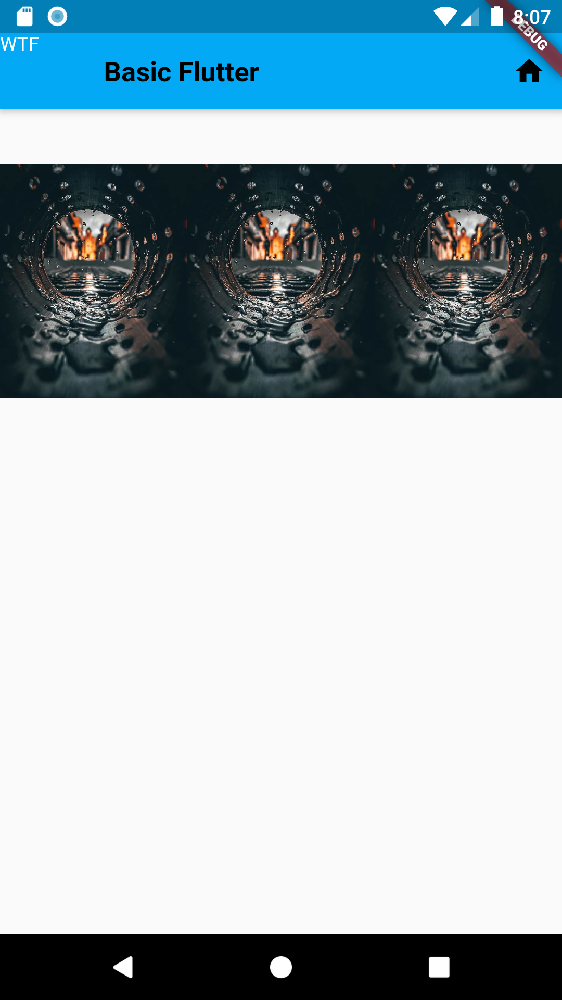

<span style="color: red">Code:</span>

```DART

Widget ImagesInRow = new Row(
  //Display images in a row space evently with equal size
  mainAxisAlignment: MainAxisAlignment.spaceEvenly,
  children: [
    for (int i = 1; i <= 3; i++) //will make  3 Expanded widgets!
      Expanded(
        child: Image.asset("images/wallpaper.jpg"),
      ),
  ],
);

```


<sapn style="color:green">Output:</span>



Modified : Can select a image to focus using flex !


```Dart


Widget FocusImagesInRow = new Row(
  //Display images in a row giving one image focus.
  // Default flex value 1;
  mainAxisAlignment: MainAxisAlignment.spaceEvenly,
  children: [
    Expanded(
      flex: 1,
      child: Image.asset("images/wallpaper.jpg"),
    ),
    Expanded(
      flex: 2,
      child: Image.asset("images/img.jpeg"),
    ),
    Expanded(
      flex: 1,
      child: Image.asset("images/wallpaper.jpg"),
    ),
  ],
);


```

<sapn style="color:green">Output:</span>

